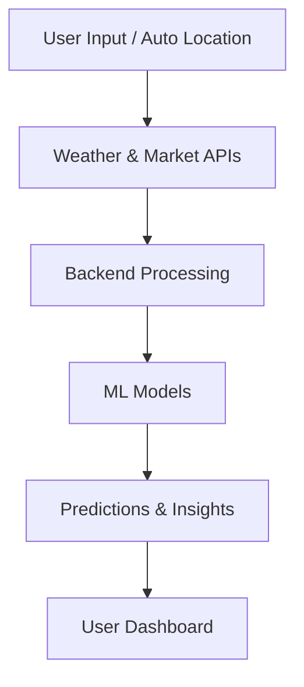

# 🌾 Harvestify  
### *Your Intelligent Digital Farm Assistant*

<p align="center">
  <b>AI-Powered • Real-Time • Farmer-Centric • Offline-Ready</b><br><br>
  
  
  
  
  
</p>

---

## 🌐 Live Demo

🔗 https://harvestify-xyz.vercel.app/

---

## 🚀 Overview

**Harvestify** is a full-stack AgriTech platform that empowers farmers with **real-time insights, AI-driven recommendations, and intelligent automation** to make smarter farming decisions.

By combining **weather intelligence, live market data, and machine learning models**, Harvestify transforms raw agricultural data into **clear, actionable insights** — acting as a true **digital farm assistant**.

---

## 🧠 What Makes Harvestify Powerful?

> It doesn’t just show data — it **thinks, analyzes, and recommends**.

* 📍 Auto-detects user location
* 🌤️ Fetches real-time environmental data
* 🌱 Recommends best crops
* 📈 Predicts yield outcomes

👉 All with **minimal user input**

---

## ✨ Key Features

---

### 🌱 Intelligent Crop Recommendation

* AI-based prediction using Random Forest
* Supports soil inputs (NPK, pH) *(optional)*
* 📍 Auto-location detection
* 🌤️ Weather-integrated recommendations
* Top 3 crop suggestions with confidence %
* Detailed crop insights (fertilizer, season, water needs)

---

### 📈 Smart Yield Prediction

* Predicts crop yield using LSTM models
* Outputs:

  * kg/acre
  * total yield
  * bag estimation
* 📍 Location + 🌤️ weather auto-detection
* Yield rating (Excellent → Poor)
* Smart alerts based on environmental conditions

---

### 🔬 Disease Detection System

* Upload crop leaf images 📷
* CNN (MobileNetV2) for classification
* 38+ disease categories
* Confidence score + severity level
* Treatment and prevention recommendations

---

### 🌤️ Real-Time Weather Intelligence

* Live weather data (temperature, humidity, rainfall)
* Air Quality Index (AQI)
* Location-based auto-detection
* Integrated across multiple modules

---

### 📊 Market Price Insights

* Real-time mandi crop prices
* Location-based filtering
* Price trend analysis
* Helps farmers make profitable selling decisions

---

### 🤖 Chatbot & Voice Assistant

* Powered by Google Gemini AI
* Answers agricultural queries
* 📴 **Offline support for basic questions**
* 🌐 **Real-time responses when connected to internet**
* Voice-enabled interaction
* Conversation history storage

---

### 🔐 Authentication & User System

* Firebase Authentication
* Email/password login
* Phone OTP verification
* Protected routes
* User-specific data storage

---

### 📊 Dashboard & Analytics

* Yield trend graphs
* Crop comparison charts
* Risk analysis (weather, soil, pests, market)
* Visual insights for decision-making

---

### 🌐 Multi-Language Support

* English
* Hindi (हिंदी)
* Marathi (मराठी)
* Auto-detection and seamless switching

---

## ⚙️ How It Works



---

## 🛠️ Tech Stack

### 🎨 Frontend

* React 18
* Tailwind CSS
* Framer Motion
* Recharts / Chart.js
* i18next

### ⚙️ Backend

* Node.js
* Express.js
* FastAPI (for ML services)

### 🤖 AI / ML

* Random Forest → Crop Recommendation
* CNN (MobileNetV2) → Disease Detection
* LSTM → Yield Prediction

### 🔗 APIs & Services

* WeatherAPI → Weather data
* data.gov.in → Market prices
* Google Gemini AI → Chatbot
* Firebase → Authentication & Database

---

## ⚡ Getting Started

```bash
git clone https://github.com/srutinadar26/Harvestify.git
cd Harvestify
npm install
npm start
```

---

## 🌍 Vision

To build a scalable, intelligent agricultural ecosystem that enables farmers to make **confident, data-driven decisions** and improve productivity across regions.

---

## 💡 Why Harvestify?

* 📉 Reduces farming risks
* 📈 Improves productivity
* 💰 Increases profitability
* 🌍 Works even in low-connectivity environments
* 🧠 Combines AI + real-time data seamlessly

---


