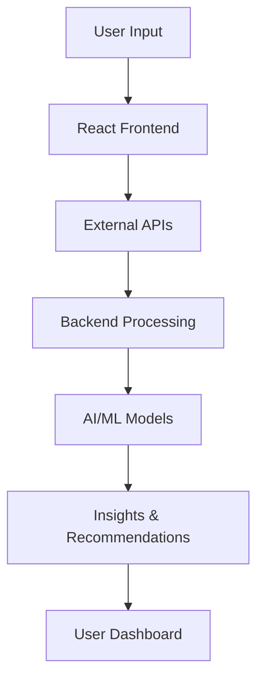

---

# 🌾 Harvestify

### *Your Intelligent Digital Farm Assistant*

<p align="center">
  <b>AI-Powered • Real-Time Data • Farmer-Centric</b><br><br>
  
  
</p>

---

## 🚀 Overview

**Harvestify** is a full-stack AgriTech platform that empowers farmers with **real-time insights, intelligent recommendations, and accessible tools** to make better agricultural decisions.

By integrating **weather intelligence, live market data, government resources, and AI-driven analysis**, Harvestify transforms complex agricultural information into **simple, actionable guidance**.

---

## ✨ Key Features

### 🌤️ Real-Time Weather Intelligence

* Live weather data with temperature, humidity, and conditions
* Air Quality Index (AQI) monitoring
* Multi-day forecasts
* Location-based weather detection
* Smart alerts for changing conditions

---

### 📊 Live Mandi Market Prices

* Real-time crop prices from government data sources
* Price trend indicators (rise/fall/stable)
* Filter by state, crop, and location
* Statistical insights (average, highest, lowest prices)

---

### 🌱 Intelligent Crop Recommendation

* Suggests the most suitable crops based on environmental conditions
* Considers weather, location, and agricultural factors
* Provides reasoning and confidence insights
* Designed to support data-driven farming decisions

---

### 🔬 Crop Disease Detection

* Image-based disease identification using deep learning (CNN)
* Detects plant diseases from leaf images
* Provides treatment suggestions and preventive measures

---

### 🏛️ Government Schemes & Agricultural Resources

* Access to major Indian government schemes
* Direct links to official portals
* Farmer-centric programs and subsidies
* Informational cards for easy understanding

---

### 🌐 Multi-Language Support

* English
* Hindi (हिंदी)
* Marathi (मराठी)
* Seamless language switching for accessibility

---

### 🤖 Chatbot & Voice Assistant
Interactive chatbot providing instant farming guidance
Voice-enabled interaction for improved accessibility
Offline-first support for general agricultural queries, ensuring usability in low-connectivity regions
Dynamic responses for real-time data (weather, market prices, alerts) when connected to the internet
Built to support farmers with minimal technical experience

---

### 🎨 Modern User Experience

* Clean, intuitive interface
* Dark and Light mode support
* Fully responsive (mobile, tablet, desktop)
* Smooth animations and transitions
* Real-time feedback and notifications

---

## 🧠 How It Works



---

## 🛠️ Tech Stack

### Frontend

* React
* Tailwind CSS
* React Router
* Context API
* Framer Motion
* Recharts
* i18next

### Backend

* Node.js
* Express.js

### APIs & Services

* WeatherAPI (real-time weather data)
* data.gov.in (market prices)
* Firebase Authentication

### AI / Machine Learning

* Random Forest / XGBoost (crop recommendation)
* Convolutional Neural Networks (CNN) (disease detection)

### Database

* MongoDB

---

## ⚡ Getting Started

```bash
git clone https://github.com/srutinadar26/Harvestify.git
cd Harvestify
npm install
npm start
```

---

## 🌍 Vision

To build a scalable, intelligent agricultural ecosystem that empowers farmers with **data, technology, and confidence** to make smarter decisions and improve productivity.

---

## 💬 Final Note

> *“When farmers grow better, India grows better.”* 🌾🇮🇳

---
